# Test-Driven Development Integration Guide

## Overview

We've integrated a comprehensive TDD (Test-Driven Development) system into your Python boilerplate. This ensures tests are written before code, validates implementations against tests, and maintains high code quality throughout development.

## What's New

### 1. Commands
- **`/generate-tests`** (`/gen-tests`, `/tdd-tests`) - Generate comprehensive test suites from PRD/PRP
- **`/tdd-config`** - Configure TDD settings and enforcement

### 2. Hooks
- **`19-test-generation-enforcer.py`** - Blocks code creation without existing tests
- **`12-code-test-validator.py`** - Automatically runs tests after code changes

### 3. Workflow Chains
- **`/chain tdd`** - Complete TDD feature workflow
- **`/chain tf`** - Test-first approach
- **`/chain vi`** - Validate implementation

### 4. Enhanced Templates
- PRP templates now include comprehensive test specifications
- Test patterns for unit, integration, E2E, and performance tests

## How It Works

### The TDD Flow

```mermaid
graph LR
    A[PRD/PRP] --> B[Generate Tests]
    B --> C[Tests Fail 🔴]
    C --> D[Write Code]
    D --> E[Run Tests]
    E --> F{Pass?}
    F -->|No| D
    F -->|Yes| G[Tests Pass 🟢]
    G --> H[Refactor]
    H --> E
```



### 1. Test Generation Phase

When you run `/generate-tests user-auth`, the system:

1. **Analyzes** PRD/PRP for acceptance criteria
2. **Extracts** testable requirements
3. **Generates** test files with proper structure:
   ```
   tests/
   ├── unit/test_user_auth_models.py
   ├── integration/test_user_auth_api.py
   └── e2e/test_user_auth_scenarios.py
   ```

4. **Creates** test manifest tracking requirements

### 2. Test Enforcement Phase

When you try to create `src/services/user_auth.py`:

1. **Hook checks** for corresponding tests
2. **Blocks** if tests don't exist
3. **Suggests** running `/generate-tests`
4. **Shows** what needs testing

### 3. Validation Phase

After writing code:

1. **Hook runs** related tests automatically
2. **Reports** pass/fail status
3. **Shows** coverage metrics
4. **Blocks** if tests fail (configurable)

## Usage Examples

### Example 1: New Feature with TDD

```bash
# Start with PRD
/py-prd "User Authentication System"

# Use TDD workflow
/chain tdd

# This automatically:
# 1. Creates PRP with test specs
# 2. Generates comprehensive tests
# 3. Creates issues
# 4. Blocks code without tests
# 5. Validates implementation
```

### Example 2: Manual Test-First

```bash
# Generate tests for specific component
/generate-tests user-model

# Try to run tests (they should fail)
/test-runner

# Now implement the code
/py-agent UserModel

# Tests run automatically and should pass
```

### Example 3: Adding Tests to Existing Code

```bash
# Check what needs tests
/pyexists UserService

# Generate tests for existing service
/generate-tests --update user-service

# Run to ensure current code passes
/test-runner
```

## Configuration

### Default Settings (Strict TDD)
```json
{
  "tdd": {
    "enforce": true,
    "coverage_threshold": 80,
    "allow_override": false
  }
}
```

### Relaxed Settings (For Migration)
```bash
# Allow warnings instead of blocking
/tdd-config allow-override

# Lower coverage requirement
/tdd-config coverage 60
```

### Disable for Specific Files
```python
# In your Python file
# pragma: no-tdd
# This file is exempt from TDD requirements
```

## Test Patterns

### Unit Test Pattern
```python
def test_should_validate_email_format():
    """Email validation should reject invalid formats."""
    # Given
    invalid_email = "not-an-email"
    
    # When/Then
    with pytest.raises(ValidationError) as exc:
        User(email=invalid_email)
    
    assert "valid email" in str(exc.value)
```

### Integration Test Pattern
```python
async def test_api_endpoint_requires_auth():
    """API endpoints should require authentication."""
    # Given
    client = TestClient(app)
    
    # When
    response = client.get("/users/me")
    
    # Then
    assert response.status_code == 401
    assert response.json()["detail"] == "Not authenticated"
```

### Fixture Pattern
```python
@pytest.fixture
def authenticated_client(client, test_user):
    """Client with valid auth headers."""
    token = create_access_token(test_user.id)
    client.headers["Authorization"] = f"Bearer {token}"
    return client
```

## Benefits

1. **Specification First**: Tests document expected behavior
2. **Regression Prevention**: Changes can't break existing features
3. **Design Improvement**: TDD forces better API design
4. **Confidence**: Refactor without fear
5. **Documentation**: Tests serve as usage examples

## Common Scenarios

### Scenario: "I need to fix a bug"
1. Write a test that reproduces the bug
2. Run test (it should fail)
3. Fix the bug
4. Run test (it should pass)
5. Run all tests to ensure no regression

### Scenario: "I'm refactoring"
1. Ensure all tests pass first
2. Make refactoring changes
3. Tests validate nothing broke
4. If tests fail, fix or revert

### Scenario: "Requirements changed"
1. Update tests to match new requirements
2. Run tests (they should fail)
3. Update implementation
4. Run tests (they should pass)

## Troubleshooting

### "Tests Required" but I'm prototyping
```bash
# Temporarily disable for session
/tdd-config override-once

# Or create minimal test
echo "def test_placeholder(): pass" > tests/unit/test_feature.py
```

### Tests not found
```bash
# Check test discovery
pytest --collect-only

# Ensure proper naming
# ✅ test_user_auth.py
# ❌ user_auth_test.py
```

### Tests timing out
```python
# Add timeout to specific test
@pytest.mark.timeout(5)
def test_slow_operation():
    pass
```

## Best Practices

1. **Write the test name first** - Clarifies what you're testing
2. **One assertion per test** - Clear failure messages
3. **Use descriptive names** - `test_should_reject_expired_token`
4. **Follow AAA pattern** - Arrange, Act, Assert
5. **Keep tests fast** - Mock external dependencies
6. **Test behavior, not implementation** - Focus on outcomes

## Integration with Existing Commands

- `/py-prd` - Now includes test specifications section
- `/prp-create` - Generates detailed test requirements
- `/capture-to-issue` - Can capture test scenarios
- `/grade` - Considers test coverage in scoring

## Next Steps

1. **Enable TDD**: Already done by default!
2. **Try it out**: Run `/chain tdd` for your next feature
3. **Monitor**: Use `/tdd-config` to check compliance
4. **Adjust**: Tweak settings based on your team's needs

The TDD system is now fully integrated and ready to improve your code quality! 🚀