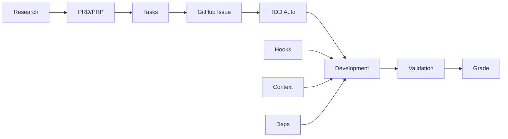

# 🎯 Python Boilerplate Feature Matrix

Complete overview of ALL features and when to use them.

## 📊 Feature Categories

### 1. Planning & Requirements

| Feature | Command | Purpose | When to Use |
|---------|---------|---------|-------------|
| **PRD** | `/py-prd` | Product Requirements Document | Every new feature |
| **PRP** | `/prp-create` | Deep research + validation | Complex/external integrations |
| **Research** | `/research` | Capture research findings | Before building anything new |
| **Specs** | `/specs capture` | Save successful patterns | After implementing something reusable |

### 2. Task & Issue Management

| Feature | Command | Purpose | When to Use |
|---------|---------|---------|-------------|
| **Task Generation** | `/gt` | Break PRD into tasks | After creating PRD |
| **GitHub Issues** | `/cti` | Create issue + tests | Starting implementation |
| **Issue Board** | `/issue-kanban` | Visual task tracking | Managing multiple features |
| **Task Status** | `/ts` | Current progress | Multiple times daily |
| **Task Board** | `/tb` | Visual task view | Planning sprints |

### 3. Development Automation

| Feature | Command | Purpose | When to Use |
|---------|---------|---------|-------------|
| **TDD Auto** | `/fw start` | Auto-generate tests | Starting any feature |
| **Component Guards** | `/pyexists` | Prevent duplicates | Before creating anything |
| **Import Updates** | Auto hook | Fix imports after moves | Happens automatically |
| **Pattern Learning** | Auto hook | Learn from success | Happens automatically |

### 4. Code Generation

| Feature | Command | Purpose | When to Use |
|---------|---------|---------|-------------|
| **AI Agents** | `/py-agent` | Pydantic AI agents | Building AI features |
| **API Endpoints** | `/py-api` | FastAPI endpoints | Creating REST APIs |
| **Data Pipelines** | `/py-pipeline` | Prefect workflows | ETL/data processing |
| **Test Generation** | `/generate-tests` | Create test suites | Usually automatic |

### 5. Quality Assurance

| Feature | Command | Purpose | When to Use |
|---------|---------|---------|-------------|
| **Stage Validation** | `/stage-validate` | Enforce quality gates | Between stages |
| **Grading** | `/grade` | PRD alignment score | After implementation |
| **Security Check** | `/security-check` | Security scanning | Before deployment |
| **Performance** | `/performance-monitor` | Track speed | During optimization |

### 6. Dependency Management

| Feature | Command | Purpose | When to Use |
|---------|---------|---------|-------------|
| **Dependency Scan** | `/pydeps scan` | Full dependency graph | Weekly/monthly |
| **Check Dependencies** | `/pydeps check` | What uses module? | Before refactoring |
| **Breaking Changes** | `/pydeps breaking` | Impact analysis | Before major changes |
| **Circular Imports** | `/pydeps circular` | Find import loops | When errors occur |

### 7. Context & State

| Feature | Command | Purpose | When to Use |
|---------|---------|---------|-------------|
| **Smart Resume** | `/sr` | Restore all context | Start of EVERY session |
| **Checkpoints** | `/checkpoint` | Save state | After major work |
| **Context Profiles** | `/context-profile` | Switch contexts | Multiple features |
| **Compression** | `/compress-context` | Optimize tokens | When context large |

### 8. Knowledge Management

| Feature | Command | Purpose | When to Use |
|---------|---------|---------|-------------|
| **Doc Cache** | `/doc-cache` | Offline documentation | External API work |
| **Gists** | `/gist-save` | Reusable snippets | Useful code patterns |
| **Response Capture** | Auto hook | Save AI insights | Happens automatically |
| **Knowledge Share** | Auto hook | Team learning | On session end |

### 9. Multi-Agent Orchestration

| Feature | Command | Purpose | When to Use |
|---------|---------|---------|-------------|
| **Orchestrate** | `/orch` | Parallel execution | 10+ tasks |
| **Spawn Agents** | `/spawn-agent` | Create sub-agents | During orchestration |
| **Agent Status** | `/sas` | Monitor progress | During orchestration |
| **Assign Tasks** | `/at` | Distribute work | Manual orchestration |

### 10. Hooks (Automatic)

| Hook Type | Count | Purpose | Examples |
|-----------|-------|---------|----------|
| **Pre-Tool** | 19 | Prevent mistakes | Creation guard, PII protection |
| **Post-Tool** | 13 | Learn & track | Pattern learning, state save |
| **Notification** | 4 | Team awareness | PR feedback, smart suggest |
| **Stop** | 4 | Clean shutdown | Save transcript, handoff prep |

## 🔄 Complete Feature Workflow

## 📈 Feature Usage by Scenario

### Simple API Endpoint (2-4 hours)
- ✅ PRD, Tasks, TDD, Basic validation
- ❌ PRP, Orchestration, Complex patterns

### External Integration (1-2 days)
- ✅ PRP, Doc cache, Specs capture, Full validation
- ✅ Research, Pattern learning, Response capture

### Large Feature (3+ days)
- ✅ Everything including orchestration
- ✅ Multiple context profiles, Team coordination

### Bug Fix (< 2 hours)
- ✅ Bug tracking, Test generation, Quick validation
- ❌ PRD, PRP, Orchestration

## 💡 Power User Tips

1. **Combine Features**: `/cti --tests --create-prp` for maximum automation
2. **Use Chains**: `/chain tdd` combines multiple commands
3. **Trust Hooks**: Let automation handle repetitive tasks
4. **Check First**: Always `/pyexists` before creating
5. **Grade Often**: `/grade` keeps you aligned with requirements

## 🎯 Remember

This system provides:
- **Planning**: PRD, PRP, Research, Specs
- **Execution**: TDD, Orchestration, Components
- **Quality**: Validation, Grading, Security
- **Intelligence**: Learning, Context, Dependencies
- **Automation**: 35+ hooks working constantly

Use ALL these features together for maximum productivity!
