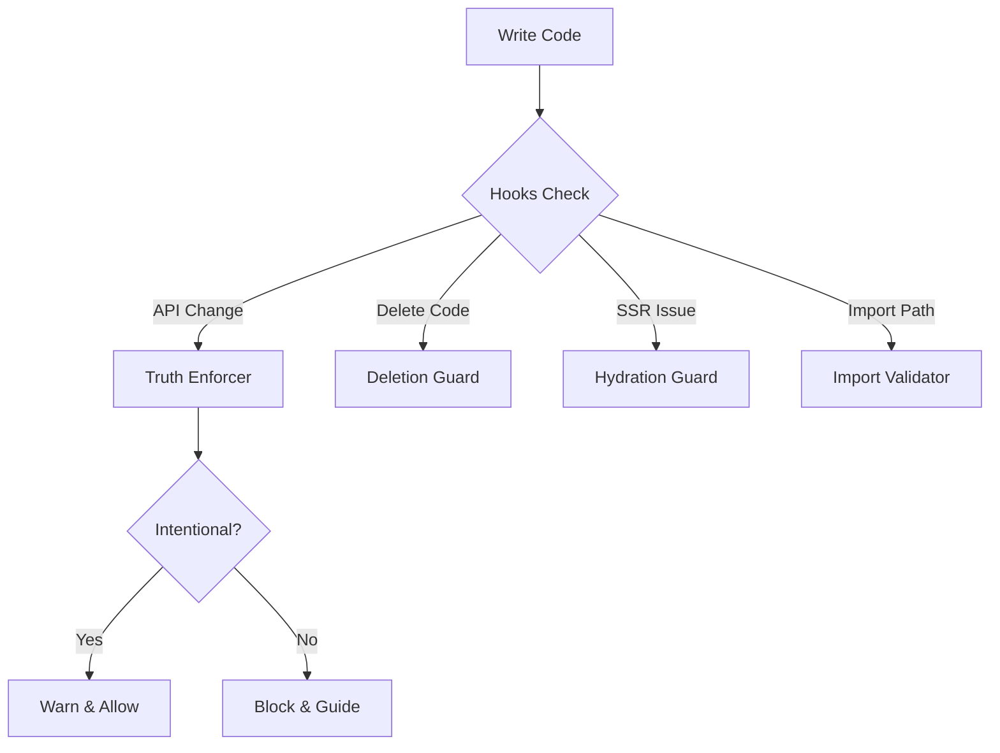

# Claude Code Workflow Guide

## 🎯 Your Daily Workflow in Claude Code

### 🌅 Starting Your Day

```mermaid
graph LR
    A[Claude Code .]
    A --> B[/sr - Smart Resume]
    B --> C{New Safety Features}
    C --> D[Truth Enforcement ✓]
    C --> E[Deletion Guard ✓]
    C --> F[Hydration Safety ✓]
    C --> G[Import Validation ✓]
```

**What happens:**
1. `/sr` restores your complete context
2. Shows active safety features
3. Tells you exactly where you left off
4. All hooks load automatically

### 🏗️ Before Creating Anything

```mermaid
graph LR
    A[Need Component?]
    A --> B[/exists Button]
    B --> C{Exists?}
    C -->|Yes| D[Edit existing]
    C -->|No| E[/pc Button]
    E --> F[/cc ui Button]
```

**Commands:**
- `/exists [name]` - Check first!
- `/pc [name]` - Pre-component chain
- `/cc [type] [name]` - Create if safe

### 🔒 Protected Development Flow



**Automatic protection:**
- Changing API route? → Need "refactor" context
- Deleting code? → Shows what's being removed
- `Math.random()`? → Suggests useEffect
- Bad import? → Shows correct path

### 🚀 Feature Development

```mermaid
graph LR
    A[GitHub Issue]
    A --> B[/fw start N]
    B --> C[/prd feature]
    C --> D[/gt feature]
    D --> E[/pt feature]
    E --> F[/btf feature]
    F --> G[/fw complete N]
```

**Full workflow:**
1. Start from GitHub issue
2. Create PRD
3. Generate tasks
4. Process systematically
5. Test everything
6. Create PR

### ✅ Safe Commit Flow

```mermaid
graph LR
    A[Ready to Commit]
    A --> B[/chain safe-commit]
    B --> C[Check Facts]
    B --> D[Validate Design]
    B --> E[Fix Linting]
    B --> F[Run Tests]
    C & D & E & F --> G[git commit]
```

**One command:**
```bash
/chain safe-commit
# or just /sc
```

### 🔄 Refactoring Workflow

```mermaid
graph TD
    A[Need to Change API/Schema]
    A --> B[/facts]
    B --> C[See Current State]
    C --> D{How to proceed?}
    D -->|Task Based| E[/todo add 'Refactor API v2']
    D -->|Manual| F[/truth-override 'reason']
    E & F --> G[Make Changes]
    G --> H[Update All References]
    H --> I[/facts - Verify]
```

**Methods to allow changes:**
1. Include "refactor" in task
2. Use `/truth-override`
3. Commit with "refactor:"

## 📊 Decision Trees

### "Should I create this component?"
```
START
  ↓
/exists ComponentName
  ↓
Exists? ─── YES → Edit existing file
  │ 
  NO
  ↓
/pc ComponentName
  ↓
All clear? ─── NO → Fix issues first
  │
  YES
  ↓
/cc feature ComponentName
```

### "Can I change this value?"
```
START
  ↓
/facts [category]
  ↓
Is it established? ─── NO → Change freely
  │
  YES
  ↓
Is it intentional? ─── NO → Don't change
  │
  YES
  ↓
Use /truth-override
or include "refactor" in task
```

## 🎨 Visual Indicators

### Hook Response Types
- 🚫 **RED** = Blocked (must fix)
- ⚠️ **YELLOW** = Warning (be careful)
- ✅ **GREEN** = Allowed (intentional)
- 📝 **BLUE** = Info (FYI only)

### Command Feedback
```
/exists Button
❌ NOT FOUND → Safe to create
✅ FOUND → Already exists, don't recreate

/facts api
🛣️ Protected routes shown
⚠️ Changes require override

/chain safe-commit
✅ ✅ ✅ ✅ All checks passed
```

## 🔥 Power User Tips

### Quick Muscle Memory
```bash
sr       # Start session
check    # Before creating  
truth    # See facts
sc       # Safe commit
fg all   # Generate from fields
```

### Workflow Chains
```bash
/chain pre-component     # Before any component
/chain safe-commit      # Before any commit
/chain field-sync       # After field changes
```

### Override When Needed
```bash
# Quick override for refactoring
/override "API v2 migration"

# Or just name your task well
/pt "Refactor auth endpoints to v2"
```

## 🆘 When Things Go Wrong

### "Hook is blocking me!"
1. Read the error message
2. Is this change intentional?
3. Use `/truth-override` if yes
4. Follow the fix suggestion if no

### "Claude deleted my code!"
1. Deletion guard should have warned
2. Use `git checkout -- file` to restore
3. Report if guard didn't catch it

### "Getting hydration errors"
1. Hook shows exact issue
2. Follow useEffect pattern shown
3. Test in dev mode

### "Import paths are messy"
1. Let import validator guide you
2. Use @/ for root imports
3. Be consistent

## 📱 Mobile View

Even on small screens:
- Commands work the same
- Hooks provide clear messages
- Quick reference available via `/help`
- All features mobile-friendly

---

Remember: The system handles the complexity. You just build!