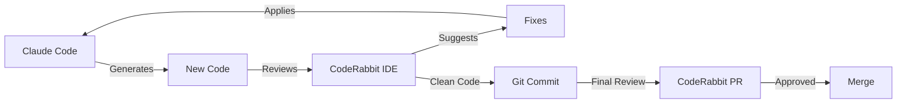

# CodeRabbit Integration Guide

## Overview

CodeRabbit provides AI-powered code review that complements Claude Code in Cursor. This creates a "generate fast, review smart" workflow.

## Setup Instructions

### 1. Install CodeRabbit IDE Extension in Cursor

1. Open Cursor
2. Go to Extensions (Cmd+Shift+X)
3. Search for "CodeRabbit"
4. Click Install
5. Sign up for free account at https://app.coderabbit.ai
6. Configure in settings:
   - AI Agent: Select "Claude Code (claude CLI)"
   - Review Mode: "On Commit"
   - Auto-fix: Enable for simple issues

### 2. Configure for Your Design System

CodeRabbit will learn your design system rules from the boilerplate, but you can add custom rules:

```yaml
# .coderabbit.yaml (already exists in boilerplate)
reviews:
  auto_review:
    enabled: true
    ignore_title_keywords:
      - "WIP"
      - "DO NOT REVIEW"
  
  path_instructions:
    - path: "components/**"
      instructions: |
        - Enforce text-size-[1-4] only (no text-sm, text-lg, etc)
        - Enforce font-regular and font-semibold only
        - All spacing must be divisible by 4
        - Minimum touch targets: 44px
    
    - path: "**/*.tsx"
      instructions: |
        - Check for proper TypeScript types
        - Ensure React components follow our patterns
        - Validate Tailwind classes against design system
```

## Workflow Integration

### The Dual-AI Development Flow



### Daily Workflow

1. **Start Feature** (Claude Code)
   ```bash
   /fw start 123
   /prd feature-name
   ```

2. **Generate Code** (Claude Code)
   ```bash
   /cc Button --variant primary
   /pt feature-name
   ```

3. **Real-time Review** (CodeRabbit IDE)
   - Automatic as you code
   - See issues in problems panel
   - One-click fixes for simple issues

4. **Complex Fixes** (Back to Claude)
   - Copy CodeRabbit suggestion
   - Paste to Claude: "Apply this fix: [suggestion]"
   - Claude implements the fix

5. **Commit Clean Code**
   ```bash
   git add .
   git commit -m "feat: implement button"
   # CodeRabbit does final check
   ```

6. **PR Status Check**
   ```bash
   /pr-feedback
   # Quick summary of PR status
   ```

## Benefits of This Integration

### 1. **Catch Issues Early**
- Design violations caught before commit
- No more "fix formatting" PRs
- Cleaner git history

### 2. **Learn While Coding**
- CodeRabbit explains why something is wrong
- Improves your coding over time
- Reinforces team standards

### 3. **Speed + Quality**
- Claude Code: 10x faster generation
- CodeRabbit: 95% bug catch rate
- Combined: Fast AND clean code

### 4. **Perfect for Solo Devs**
- Enterprise-level reviews without a team
- Consistent quality standards
- Learning acceleration

## Common Scenarios

### Scenario 1: Design System Violation
```typescript
// Claude generates:
<button className="text-sm font-bold">

// CodeRabbit flags:
"❌ Use text-size-3 instead of text-sm"
"❌ Use font-semibold instead of font-bold"

// One-click fix or copy to Claude
```

### Scenario 2: Missing Error Handling
```typescript
// Claude generates:
const data = await fetch('/api/data');

// CodeRabbit suggests:
"Add try-catch block and handle errors"

// Copy suggestion to Claude for implementation
```

### Scenario 3: Performance Issue
```typescript
// Claude generates:
useEffect(() => {
  fetchData();
}); // Missing dependency array

// CodeRabbit warns:
"This effect runs on every render"

// Quick fix: Add dependency array
```

## Configuration Tips

### 1. **Optimize for Your Workflow**
- Turn off review-on-save (too noisy)
- Keep review-on-commit (quality gate)
- Enable auto-fix for formatting
- Manual fix for logic issues

### 2. **Custom Rules for FreshSlate**
Add to `.coderabbit.yaml`:
```yaml
path_instructions:
  - path: "app/**/page.tsx"
    instructions: "Check for proper metadata exports"
  
  - path: "components/forms/**"
    instructions: "Verify PII handling and TCPA compliance"
```

### 3. **Team Coordination**
- CodeRabbit learns from team preferences
- Shares knowledge across developers
- Consistent standards enforcement

## Troubleshooting

### "Too Many Suggestions"
- Adjust sensitivity in settings
- Focus on errors first, warnings later
- Use path-specific rules

### "Conflicts with Claude"
- They work at different stages
- Claude generates, CodeRabbit reviews
- No actual conflicts

### "Slowing Me Down"
- Disable review-on-save
- Use keyboard shortcuts
- Batch fixes at commit time

## Best Practices

1. **Let CodeRabbit Learn**
   - Accept/reject suggestions consistently
   - It adapts to your style

2. **Use Both Tools' Strengths**
   - Claude: Creative problem solving
   - CodeRabbit: Systematic quality checks

3. **Don't Fight the System**
   - If CodeRabbit flags it repeatedly, fix the pattern
   - Update your templates/snippets

4. **Regular Housekeeping**
   - Review CodeRabbit reports weekly
   - Update rules based on common issues
   - Share learnings with team

## The Bottom Line

CodeRabbit + Claude Code = Best of both worlds:
- **Speed** from AI generation
- **Quality** from AI review
- **Learning** from continuous feedback
- **Consistency** across all code

This isn't about adding more tools—it's about creating a sustainable workflow for AI-accelerated development that maintains professional standards.