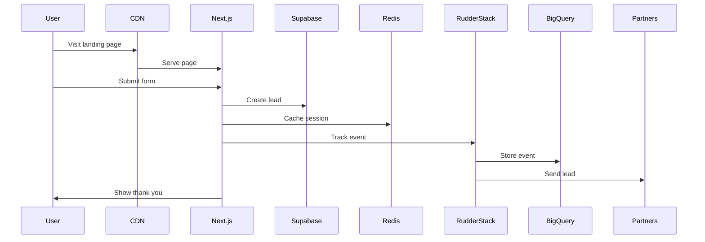
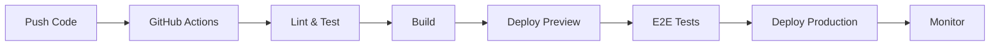

# FreshSlate System Architecture

## Overview

FreshSlate is a high-performance lead generation platform built on modern serverless architecture. This document outlines our technical architecture, data flow, and system components.

## Architecture Diagram

```
┌─────────────────────────────────────────────────────────────────┐
│                         Edge Network                             │
│  ┌─────────────┐  ┌──────────────┐  ┌────────────────┐         │
│  │  Cloudflare │  │ Cloudflare   │  │  Cloudflare    │         │
│  │     CDN     │  │   Workers    │  │  Rate Limiter  │         │
│  └──────┬──────┘  └──────┬───────┘  └───────┬────────┘         │
└─────────┼────────────────┼──────────────────┼──────────────────┘
          │                │                  │
          ▼                ▼                  ▼
┌─────────────────────────────────────────────────────────────────┐
│                      Application Layer                           │
│  ┌─────────────────────────────────────────────────────┐        │
│  │                   Vercel Platform                    │        │
│  │  ┌─────────────┐  ┌──────────────┐  ┌────────────┐ │        │
│  │  │  Next.js 15 │  │ Edge Runtime │  │  Serverless│ │        │
│  │  │  App Router │  │   Functions  │  │  Functions │ │        │
│  │  └─────────────┘  └──────────────┘  └────────────┘ │        │
│  └─────────────────────────────────────────────────────┘        │
└─────────────────────────────────────────────────────────────────┘
          │                │                  │
          ▼                ▼                  ▼
┌─────────────────────────────────────────────────────────────────┐
│                        Data Layer                                │
│  ┌──────────────┐  ┌──────────────┐  ┌─────────────────┐       │
│  │   Supabase   │  │ Upstash Redis│  │    BigQuery     │       │
│  │  PostgreSQL  │  │    Cache     │  │   Analytics     │       │
│  └──────────────┘  └──────────────┘  └─────────────────┘       │
└─────────────────────────────────────────────────────────────────┘
          │                │                  │
          ▼                ▼                  ▼
┌─────────────────────────────────────────────────────────────────┐
│                    Monitoring & Analytics                        │
│  ┌──────────────┐  ┌──────────────┐  ┌─────────────────┐       │
│  │    Sentry    │  │ BetterStack  │  │  RudderStack    │       │
│  │Error Tracking│  │   Uptime     │  │      CDP        │       │
│  └──────────────┘  └──────────────┘  └─────────────────┘       │
└─────────────────────────────────────────────────────────────────┘
```

## Component Details

### 1. Edge Layer (Cloudflare)

**Purpose**: Global performance, security, and rate limiting

```typescript
// Cloudflare Worker Example
export default {
  async fetch(request: Request): Promise<Response> {
    // Rate limiting
    const limited = await checkRateLimit(request);
    if (limited) return new Response('Too Many Requests', { status: 429 });
    
    // Security headers
    const response = await fetch(request);
    response.headers.set('X-Content-Type-Options', 'nosniff');
    
    return response;
  }
}
```

**Components**:
- CDN for static assets
- Workers for API proxying
- DDoS protection
- Rate limiting at edge

### 2. Application Layer (Vercel + Next.js 15)

**Purpose**: Server-side rendering, API routes, business logic

```typescript
// App structure
app/
├── (marketing)/          # Public pages
│   ├── page.tsx         # Landing page
│   └── quiz/           # Quiz funnel
├── api/                # API routes
│   ├── v1/
│   │   ├── leads/
│   │   └── analytics/
│   └── webhooks/
└── (admin)/            # Protected pages
```

**Key Features**:
- React Server Components
- Streaming SSR
- Edge Runtime for performance
- ISR for marketing pages

### 3. Data Layer

#### Supabase (Primary Database)
```sql
-- Core tables
leads               # Lead information
quiz_sessions      # Quiz progress tracking
partner_matches    # Lead-partner matching
analytics_events   # Event tracking
```

#### Upstash Redis (Caching & Sessions)
```typescript
// Cache patterns
- Session storage (24h TTL)
- API response cache (5-60min TTL)
- Rate limiting counters
- Distributed locks
```

#### BigQuery (Analytics Warehouse)
```sql
-- Analytics tables
events.lead_events     # All lead interactions
events.page_views      # Page view tracking
events.conversions     # Conversion events
aggregated.daily_kpis  # Pre-computed metrics
```

### 4. Data Flow Patterns

#### Lead Capture Flow


#### Real-time Analytics Flow
```typescript
// Event flow
1. User action → 
2. Client tracks → 
3. RudderStack processes → 
4. Routes to destinations:
   - BigQuery (warehouse)
   - Google Analytics (marketing)
   - Facebook (conversions)
   - Partner webhooks
```

## Security Architecture

### Authentication & Authorization

```typescript
// API Authentication
- Public endpoints: Rate limited
- Partner endpoints: API key auth
- Admin endpoints: Supabase Auth + RLS
- Webhooks: Signature verification
```

### Data Protection

```typescript
// Encryption
- At rest: AES-256 (Supabase)
- In transit: TLS 1.3
- PII handling: Encrypted fields
- Compliance: CCPA/GDPR ready
```

### Security Headers

```typescript
// Applied at edge (Cloudflare) and origin (Vercel)
Content-Security-Policy: default-src 'self';
X-Frame-Options: DENY
X-Content-Type-Options: nosniff
Referrer-Policy: origin-when-cross-origin
Permissions-Policy: camera=(), microphone=()
```

## Performance Optimization

### Caching Strategy

```typescript
// Multi-layer caching
1. Browser Cache
   - Static assets: 1 year
   - API responses: 5 minutes

2. CDN Cache (Cloudflare)
   - HTML: 5 minutes
   - Assets: 1 year
   - API: Pass through

3. Application Cache (Redis)
   - Sessions: 24 hours
   - API responses: 5-60 minutes
   - Computed data: 1 hour

4. Database Cache
   - Query results: 60 seconds
   - Materialized views: 5 minutes
```

### Performance Targets

```yaml
Core Web Vitals:
  LCP: < 2.5s
  FID: < 100ms
  CLS: < 0.1

API Response Times:
  p50: < 100ms
  p95: < 500ms
  p99: < 1000ms

Uptime:
  Target: 99.9%
  Max downtime: 43min/month
```

## Scalability Design

### Horizontal Scaling

```typescript
// All components scale horizontally
- Vercel: Auto-scales functions
- Supabase: Read replicas + connection pooling
- Redis: Cluster mode
- BigQuery: Automatic scaling
```

### Load Distribution

```typescript
// Traffic distribution
1. Geographic: Cloudflare routes to nearest edge
2. Compute: Vercel balances across regions
3. Database: Read replicas for queries
4. Cache: Distributed Redis cluster
```

## Disaster Recovery

### Backup Strategy

```yaml
Databases:
  Supabase: Daily snapshots, 30-day retention
  Redis: AOF persistence + snapshots
  BigQuery: Automatic, infinite retention

Code:
  GitHub: All code versioned
  Vercel: Deployment history
  
Configuration:
  Env vars: Encrypted in Vercel
  Secrets: Stored in Vercel/Supabase
```

### Recovery Procedures

```typescript
// RTO (Recovery Time Objective): 1 hour
// RPO (Recovery Point Objective): 1 hour

1. Database failure → Restore from snapshot
2. Region failure → Traffic shifts automatically
3. Service failure → Degraded mode with cache
```

## Monitoring & Observability

### Metrics Collection

```typescript
// What we monitor
- Error rates (Sentry)
- Uptime (BetterStack)
- Performance (Vercel Analytics)
- Business metrics (BigQuery)
- User behavior (RudderStack)
```

### Alerting Rules

```yaml
Critical:
  - Error rate > 1%
  - Uptime < 99.9%
  - Response time p95 > 1s
  - Lead capture failure

Warning:
  - Error rate > 0.5%
  - Cache hit rate < 80%
  - Database connections > 80%
```

## Development Workflow

### Environments

```yaml
Development:
  - Local Supabase
  - Local Redis
  - Test analytics

Staging:
  - Preview deployments
  - Staging database
  - Test partner endpoints

Production:
  - Full monitoring
  - Real partner integration
  - Analytics enabled
```

### CI/CD Pipeline



## Cost Optimization

### Service Costs

```yaml
Fixed Costs:
  - Vercel Pro: $20/user/month
  - Supabase Pro: $25/month
  - Tailwind UI: $299 (one-time)

Variable Costs:
  - Cloudflare Workers: $0.50/million requests
  - Upstash Redis: $0.20/100k commands
  - BigQuery: $5/TB queried
  - RudderStack: Based on events
```

### Optimization Strategies

```typescript
// Cost reduction approaches
1. Aggressive caching (reduce DB queries)
2. Edge computing (reduce bandwidth)
3. Query optimization (reduce BigQuery costs)
4. Event sampling (reduce analytics costs)
```

## Future Architecture Considerations

### Planned Improvements

```yaml
Short-term (Q1):
  - GraphQL API layer
  - WebSocket support
  - Advanced caching

Medium-term (Q2-Q3):
  - Multi-region deployment
  - Event streaming (Kafka)
  - ML scoring service

Long-term (Q4+):
  - Microservices migration
  - Real-time personalization
  - Predictive analytics
```

### Technology Evaluation

```yaml
Considering:
  - Temporal for workflows
  - ClickHouse for analytics
  - Kubernetes for orchestration
  - GraphQL federation
```

Serverless Functions:
  - Vercel Functions: Main API routes
  - Google Cloud Run: Heavy processing
    - PDF generation
    - Bulk data processing
    - Partner API webhooks
    - Scheduled jobs

---

This architecture provides a scalable, secure, and performant foundation for FreshSlate's lead generation platform. All components are designed for horizontal scaling and high availability.